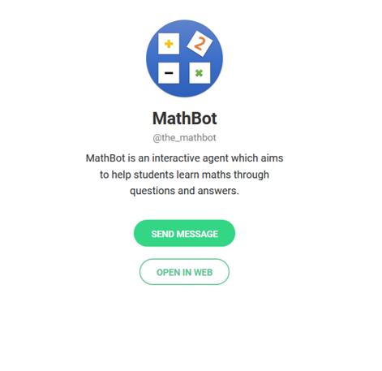

[![Build status][build-shield]][build-url]
[![Contributors][contributors-shield]][contributors-url]
[![Forks][forks-shield]][forks-url]
[![Stargazers][stars-shield]][stars-url]
[![Issues][issues-shield]][issues-url]
[![MIT License][license-shield]][license-url]

<br />
<p align="center">
  

  <h1 align="center">Math-Bot</h3>

  <p align="center">
    Bachelor Thesis Project @ University Politehnica of Bucharest<br>
    Faculty of Automatic Control and Computers<br>
    Computer Engeneering Department<br>
    <br />
    <a href="https://github.com/AlinGeorgescu/Math-Bot"><strong>Explore the docs »</strong></a>
    <br />
    <br />
    <a href="https://t.me/the_mathbot">View Demo</a>
    ·
    <a href="https://github.com/AlinGeorgescu/Math-Bot/issues">Report Bug</a>
    ·
    <a href="https://github.com/AlinGeorgescu/Math-Bot/issues">Request Feature</a>
  </p>
</p>

<details open="open">
  <summary>Table of Contents</summary>
  <ol>
    <li>
      <a href="#about-the-project">About The Project</a>
      <ul>
        <li><a href="#built-with">Built With</a></li>
      </ul>
    </li>
    <li>
      <a href="#getting-started">Getting Started</a>
      <ul>
        <li><a href="#prerequisites">Prerequisites</a></li>
        <li><a href="#launching">Launching</a></li>
      </ul>
    </li>
    <li><a href="#usage">Usage</a></li>
    <li><a href="#roadmap">Roadmap</a></li>
    <li><a href="#contributing">Contributing</a></li>
    <li><a href="#license">License</a></li>
    <li><a href="#contact">Contact</a></li>
    <li><a href="#acknowledgements">Acknowledgements</a></li>
  </ol>
</details>

## About The Project

<p align="center">
  <a href="https://t.me/the_mathbot">
  
  </a>
</p>

MathBot is an application that consists of an interactive agent and aims to help
students learn math through questions and answers. The bot is built as a
collection of Maths courses built as an interactive agent. Each course has
several learning steps and a test, in the end.

### Built With

* [Python](https://www.python.org/downloads/release/python-385/)
* [Trax](https://trax-ml.readthedocs.io)
* [Python Telegram Bot](https://python-telegram-bot.readthedocs.io)
* [Docker](https://www.docker.com/)
* [PostgreSQL](https://www.postgresql.org/)

And other libraries.

## Getting Started

The app is deployed on a cloud VM, but you can run it locally, too.

### Prerequisites

Install [Docker](https://docs.docker.com/engine/install/) and
[Docker Compose](https://docs.docker.com/compose/install/).

Create a Telegram bot using BotFather and get an API token.

Create environment files for the Docker containers, as in the following example:

* database_adapter_con_info.env
  * DB_ADAPT_PORT=5000
  * DB_ADAPT_ADDR=0.0.0.0
* database_con_info.env
  * POSTGRES_DB=db_name
  * POSTGRES_USER=db_user
  * POSTGRES_PASSWORD=db_pass
* frontend_con_info.env
  * API_TOKEN=key_from_botfather
* math_bot_con_info.env
  * MATH_BOT_PORT=5001
  * MATH_BOT_ADDR=0.0.0.0

### Launching

```
docker-compose up --build  # start the application
docker-compose rm -v       # stop the application and remove any volumes
```

## Usage

Open the chat with MathBot on Telegram and type /start. Then, the bot will send
you additional information. Type /help to list all the supported commands.

You will then start your courses and get through them, step by step. You will
have one question after finishing half of the course, it is not mandatory and
answering it will not give you any points. After the final step of a course, its
test will start. The questions must be answered for full score. The answer
should be as clear as possible and should not use abbreviations. The bot will
tell you if your answer is correct or not.

## Contributing

Contributions are what make the open source community such an amazing place to
be learn, inspire, and create. Any contributions you make are
**greatly appreciated**.

1. Fork the Project
2. Create your Feature Branch (`git checkout -b feature/AmazingFeature`)
3. Commit your Changes (`git commit -m 'Add some AmazingFeature'`)
4. Push to the Branch (`git push origin feature/AmazingFeature`)
5. Open a Pull Request

## License

Distributed under the MIT License. See `LICENSE` for more information.

## Contact

[![LinkedIn][linkedin-shield]][linkedin-url]

Author: Alin Georgescu

Project Link: [Math-Bot](https://github.com/AlinGeorgescu/Math-Bot)

## Acknowledgements
* [Othneil Drew](https://github.com/othneildrew/Best-README-Template) -
  README template
* [Rod Pierce & Math is fun](http://www.mathsisfun.com) - Some graphics for the
  courses
* Aritmetică, Algebră, Geometrie: clasa a V-a: anul școlar 2009-2010, Ediția a
  14-a, Pitești, România, Editura Paralela 45, 2009 - Some texts for the courses

<!-- MARKDOWN LINKS & IMAGES -->
[build-shield]: https://img.shields.io/github/workflow/status/AlinGeorgescu/Math-Bot/build/master?style=for-the-badge
[build-url]: https://github.com/AlinGeorgescu/Math-Bot/actions/workflows/python-app.yml
[contributors-shield]: https://img.shields.io/github/contributors/AlinGeorgescu/Math-Bot.svg?style=for-the-badge
[contributors-url]: https://github.com/AlinGeorgescu/Math-Bot/graphs/contributors
[forks-shield]: https://img.shields.io/github/forks/AlinGeorgescu/Math-Bot.svg?style=for-the-badge
[forks-url]: https://github.com/AlinGeorgescu/Math-Bot/network/members
[stars-shield]: https://img.shields.io/github/stars/AlinGeorgescu/Math-Bot.svg?style=for-the-badge
[stars-url]: https://github.com/AlinGeorgescu/Math-Bot/stargazers
[issues-shield]: https://img.shields.io/github/issues/AlinGeorgescu/Math-Bot.svg?style=for-the-badge
[issues-url]: https://github.com/AlinGeorgescu/Math-Bot/issues
[license-shield]: https://img.shields.io/github/license/AlinGeorgescu/Math-Bot.svg?style=for-the-badge
[license-url]: https://github.com/AlinGeorgescu/Math-Bot/blob/master/LICENSE
[linkedin-shield]: https://img.shields.io/badge/-LinkedIn-black.svg?style=for-the-badge&logo=linkedin&colorB=555
[linkedin-url]: https://www.linkedin.com/in/alin-georgescu-464783119/
